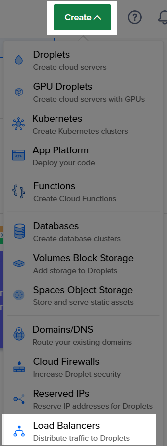

# About Assignment

Note that this is part 2 of the instructions from [part 1](https://github.com/jse-h/nginx-part1) of setting up a file server secured with UFW and configured to serve an HTML page using nginx's web server. This repository contains some modified instructions and code since this is an extension that teaches you to configure a load balancer that distributes attempted traffic across 2 servers we will be creating.

For part 2, the instructions are set up using the Arch Linux distribution for Linux. Part 2 will instruct how to setup a Bash script that generates a static index.html file that displays some system information. By using the systemd utility, a service file will be configured to execute the script with a timer file that activates the service everyday at 05:00. The HTML document will be served using the web server nginx secured by the Uncomplicated Firewall ufw package.

# Repository Contents

1. `server_setup_helper` bash script file to streamline system user setup
2. `server_unitfile_helper` bash script file to streamline service and timer setup
3. `assets` folder, images for the README

# Part 1 - Load Balancer and Droplet Deployment

## Droplet Creation

From DigitalOcean:

*DigitalOcean Droplets are Linux-based virtual machines (VMs) that run on top of virtualized hardware. Each Droplet you create is a new server you can use, either standalone or as part of a larger, cloud-based infrastructure.*

In this repository I am going to show an example of creating 2 servers or droplets using DigitalOcean's service. I will also be using a specific Arch Linux image and droplet configuration.

1. Go to DigitalOcean and on the top right, click on Create > Droplet


2. In this example, we will have to connect to our servers via SSH to configure them. Add the relevant authentication under 'Choose Authentication Method' In my example, I will be using an existing SSH key I already configured.


3. Configure your droplet set the quantity to 2 droplets. In my example, I will be using the region **San Francisco 3** and my own **custom image** of Arch Linux distribution. You can also give each a name that you would like.


>[!NOTE]
> In this example, the droplets have the tag as 'web' but they can be anything. When we configure the load balancer, it will use the tags refer to both servers, so it is important the tags match.

## Load Balancer Creation

*A load balancer is a solution that acts as a traffic proxy and distributes network or application traffic across endpoints on a number of servers. Load balancers are used to distribute capacity during peak traffic times, and to increase reliability of applications.* [^1]

1. Click on Create > Load Balancer



2. Select **Regional** for the Load Balancer Type and select the **same datacenter regions as your droplets** that were created previously.

3. Use the **default** setting for **VPC Network**

4. Choose **External (Public)** for network visibility, this means external web traffic can access this Load Balancer.

5. Change the **number of nodes** to **2** for both of our file servers

6. Type the **same tag** that you chose when you created the 2 droplets. In my example it would be 'web'.


7. Leave the forwarding rules to default (only using HTTP protocol for these instructions)

8. Finally give your Load Balancer a name and click **Create Load Balancer** on the bottom.

If you have done these steps your setup may look like this:


>[!NOTE]
> The status of your droplets may look different or as `offline` because we will need to set up the servers. Follow the instructions in part 2 to set up the servers in each droplet.

# Part 2 - Server Setup

This server setup uses the Arch Linux distribution. You will also be required to clone this git repository to get the two server setup helper bash scripts. This setup will be used for 2 servers using DigitalOcean's Droplets as our Linux-based virtual machines.

## User and File Setup

The `server_setup_helper` file is a simple bash script that will help create our system user and starting files. This script needed to be executed using `sudo`. This script will also need execute permissions using `chmod` to give it the relevant execute permissions.

To run the script, copy and run the command below while in the same directory as your script:
```bash
sudo ./server_setup_helper
```

```bash
#!/bin/bash

# Creating the system user named `webgen`
echo "Creating User 'webgen'..."
sudo useradd -r -d /var/lib/webgen -s /usr/sbin/nologin webgen

# Creating webgen's home directory
echo "Creating 'webgen' home directory..."
sudo mkdir -p /var/lib/webgen

# Creating subdirectories
echo "Creating directory structure (bin, documents, HTML)"
sudo mkdir -p /var/lib/webgen/bin /var/lib/webgen/HTML
sudo mkdir -p /var/lib/webgen/documents

# Creating nested files
echo "Setting up files..."
sudo touch /var/lib/webgen/bin/generate_index
sudo touch /var/lib/webgen/HTML/index.html
sudo touch /var/lib/webgen/documents/file-one
sudo touch /var/lib/webgen/documents/file-two
```

Next, you'll have to edit some of the files nested in `webgen`'s home directory. You will have to be using your preferred text editor, in this repository I will be using the `neovim` package as my text editor.

1. `generate_index` file

Open the `generate_index` script with the command below:
```
sudo nvim /var/lib/webgen/bin/generate_index
```

Copy and save the contents below to the script. This script takes system information and displays it and outputs it to our `index.html` file.
```bash
#!/bin/bash

set -euo pipefail

# this is the generate_index script
# you shouldn't have to edit this script

# Variables
KERNEL_RELEASE=$(uname -r)
OS_NAME=$(grep '^PRETTY_NAME' /etc/os-release | cut -d '=' -f2 | tr -d '"')
DATE=$(date +"%d/%m/%Y")
PACKAGE_COUNT=$(pacman -Q | wc -l)
PUBLIC_IP_ADRESS=$(ip -4 a show dev eth0 | grep inet | awk '{print $2}' | cut -d/ -f1)
OUTPUT_DIR="/var/lib/webgen/HTML"
OUTPUT_FILE="$OUTPUT_DIR/index.html"

# Ensure the target directory exists
if [[ ! -d "$OUTPUT_DIR" ]]; then
    echo "Error: Failed to create or access directory $OUTPUT_DIR." >&2
    exit 1
fi

# Create the index.html file
cat <<EOF > "$OUTPUT_FILE"
<!DOCTYPE html>
<html lang="en">
<head>
    <meta charset="UTF-8">
    <meta name="viewport" content="width=device-width, initial-scale=1.0">
    <title>System Information</title>
</head>
<body>
    <h1>System Information</h1>
    <p><strong>Kernel Release:</strong> $KERNEL_RELEASE</p>
    <p><strong>Operating System:</strong> $OS_NAME</p>
    <p><strong>Date:</strong> $DATE</p>
    <p><strong>Number of Installed Packages:</strong> $PACKAGE_COUNT</p>
    <p><strong>Public IP address of server:</strong> $PUBLIC_IP_ADRESS</p>
</body>
</html>
EOF

# Check if the file was created successfully
if [ $? -eq 0 ]; then
    echo "Success: File created at $OUTPUT_FILE."
else
    echo "Error: Failed to create the file at $OUTPUT_FILE." >&2
    exit 1
fi
```
2. `index.html` file

There are no changes required to the `index.html` file. We will be using the `generate_index` script to build the HTML file.

3. `file-one` and `file-two` files

Simply using your text editor, provide any sample text for this plain text file. The purpose of this file is to contain some text so you confirm the files are downloadable so the server is effectively acting as a file server. The commands below will open each file:
```
sudo nvim /var/lib/webgen/documents/file-one
sudo nvim /var/lib/webgen/documents/file-two
```

For example, in `file-one`
```
This is file one!
```

For example, in `file-two`
```
This is file two!
```

### Changing ownerships and permissions

This last step of the user and file setup is to enable permissions and ownerships for some of the files created.

Changing ownership to `webgen`:
```
sudo chown -R webgen:webgen /var/lib/webgen
```

Changing permissions for `webgen`:
```
sudo chmod 770 -R /var/lib/webgen
```

Giving execute permissions to the `generate_index` script:
```
sudo chmod +x /var/lib/webgen/bin/generate_index
```

## Service and Timer Setup

Next we will be setting up the service and timer files for the server. The service file will run our `generate_index` script and the timer will start our service at a time window we specified. This means we will get an updated `index.html`, our system information, every interval of the time specified.

The script **requires sudo privileges** to run like the previous script as well as relevant execute permissions.

Command to run the script:
```
sudo ./server_unitfile_helper
```

The contents of the script:
```bash
#!/bin/bash
SERVICE_PATH="/etc/systemd/system/generate_index.service"
TIMER_PATH="/etc/systemd/system/generate_index.timer"

sudo touch $SERVICE_PATH
sudo touch $TIMER_PATH

echo "Creating service file..."
cat <<EOF1 > "$SERVICE_PATH"
[Unit]
Description=Generate Index Script Service
Wants=network-online.target
After=network-online.target

[Service]
User=webgen
Group=webgen
ExecStart=/var/lib/webgen/bin/generate_index
EOF1

echo "Creating timer file..."
cat <<EOF2 > "$TIMER_PATH"
[Unit]
Description=Generate Index Service Timer

[Timer]
OnCalendar=*-*-* 05:00:00
Persistent=true

[Install]
WantedBy=timers.target
EOF2

```

### Enabling and starting service files

Run the command below to **enable** the timer so it starts automatically after system boot:

```
sudo systemctl enable generate_index.timer
```

Run the command below to **start** the timer:

```
sudo systemctl start generate_index.timer
```

To verify if the **status** of the timer service is active and runs successfully, run the command:

```
sudo systemctl status generate_index.timer
```

You should see part of the output message displayed that says `Active: active(waiting)` which tells that the timer is activate.

To test if the service itself runs successfully, similarly, start the service by running:

```
sudo systemctl start generate_index.service
```

>[!NOTE]
> By starting the service, you are checking the single instance of the service being ran. We **do not** want to enable the service, as the **service's execution will be handled by the timer** which is enabled instead.

And again, check the status:
```
sudo systemctl status generate_index.service
```

You will see in the output that the service's active status is `inactive(dead)` because the service has completed its task in running the `generate_index` script once, and generated the `index.html` file. To see the a detailed log, you can run the command:

```
sudo journalctl -u generate_index.service
```

Below the log you will see that the service started, then generated `index.html` file, and finally deactivated succesfully.

## nginx Setup

In this task, nginx is used and configured to act as a web server to server our `index.html` page and display the system information.

### Install nginx

First, install the nginx package by running the command:

```
sudo pacman -S nginx
```

### Configuring nginx.conf

In the configuration for nginx, I will be making use of server block files. Server block files serve as multiple domains and allows disabling and enabling certain sites. Creating server blocks helps managing separate configurations for different servers or websites easier. Since the server block is split into separte files, they can be easily disabled or enabled without heavily modifying the `nginx.conf` file.

In this configuration step, I will be using the `sites-enabled` and `sites-available` approach.

First create the following directories:

```
sudo mkdir -p /etc/nginx/sites-available /etc/nginx/sites-enabled
```

Using the text editor, create a new server block file by creating and opening the file:

```
sudo nvim /etc/nginx/sites-available/webgen.conf
```

Copy the code below into the `webgen.conf` file created:

```
server {
   listen 80;
   listen [::]:80;
   server_name webgen.sysinfo;
   root /var/lib/webgen/HTML;
   index index.html;
   
   location / {
        try_files $uri $uri/ =404;
    }

    location /documents {
        alias /var/lib/webgen/documents/;
        autoindex on;
        autoindex_exact_size off;
        autoindex_localtime on;
        try_files $uri $uri/ =404;
    }
}
```

Now that the server is configured and the index file is specified, nginx.conf needs to be configured to connect to our desired server.

Using a text editor, open the `nginx.conf` file:

```
sudo nvim /etc/nginx/nginx.conf
```

There will be a lot of default values, and since server blocks are being utilized in this configuration, there are minimal modifications required.

At the top of the `nginx.conf` file, you can see part of the file that specifies the user that is commented out:

```
...
#user http;
worker_processes 1;
...
```

Change this section of code to the code below:
```
user webgen webgen;
worker_processes auto;
```

This allows nginx the correct permissions for file management involving `webgen` and aligns the web server service with our specified user.

>[!NOTE]
> Changing the worker_processes directive is optional, but it defines for nginx the amount of connections accepted and how many processors will be made use. Using `auto` will allow nginx to auto-detect the optimal value.

A last and simple step to modifying the `conf` file is to append our `sites-enabled` directory.

In the `http` block, append the `include` code:

```
...
http {
    include /etc/nginx/sites-enabled/*;
}
...
```

Finally, enable the server block to be utilized by simply creating a symbolic link:

```
sudo ln -s /etc/nginx/sites-available/webgen.conf /etc/nginx/sites-enabled/webgen.conf
```

### Testing nginx services

After the configuration is complete, we can test our nginx services by running a few commands.

First lets restart nginx after all of our changes made:

```
sudo systemctl restart nginx
```

We can test and check for syntax errors in our `nginx.conf` file using the command:
```
sudo nginx -t
```

Then check the status of the nginx service:

```
sudo systemctl status nginx
```

>[!CAUTION]
> You may receive a warning during the status check for your nginx service that looks like:
>
> ` [warn] 18872#18872: could not build optimal types_hash, you should increase either types_hash_max_size: 1024 or types_hash_bucket_size: 64; ignoring types_hash_bucket_size`
>
> Open the `nginx.conf` file and append these configurations in the `http` block to fix this error:
> ```
> http {
>    types_hash_max_size 4096;
>    server_names_hash_bucket_size 128;
>    ...
> }
> ```
> Restart and check the status of the nginx service after making these changes.

If you see that the nginx service is `active(running)` then at this point the server should be up!

## UFW Setup for SSH and HTTP

Now that the server is configured, a firewall can be setup to secure the server. We will be using Arch Linux's Uncomplicated Firewall (UFW) which is a program that manages nftables and iptables, essentially filtering traffic before it reaches the network. In this instruction, we will set up UFW to allow `ssh` and `http` from anywhere as an instructional example. In practice, `ssh` should be only allowed in enterprise settings.

### Installing `ufw` package

First, use the `pacman` package manager to install `ufw`:
```
sudo pacman -S ufw
```

>[!WARNING]
> **Do not** enable UFW immediately after installing the package. We will need to configure it to allow ssh and http otherwise we will not have access to the remote system anymore after exiting.

### Allowing `ssh` and `http` access

For instructional reasons, we will enable ssh from anywhere. In practice, we would **only** allow ssh connections from specific and private ip addresses, as well as using host service that authorizes private connections.

To allow **ssh connection**:
```
sudo ufw allow ssh
```

We also want to **limit the rate of ssh** attempts to prevent multiple unauthorized attempted connections:
```
sudo ufw limit ssh
```

Next, since we are working with web servers, we want to allow **http connections**:
```
sudo ufw allow http
```

After each of these commands, we will see an output message saying `Rules updated` and `Rules updated (v6)`.

Finally, enable `ufw` after creating our rules:
```
sudo ufw enable
```

To **check the status** of the firewall and our rules:
```
sudo ufw status verbose
```

Your output should be displayed like below:
```
Status: active

To                         Action      From
--                         ------      ----
22                         LIMIT IN    Anywhere                  
80                         ALLOW IN    Anywhere                  
22 (v6)                    LIMIT IN    Anywhere (v6)             
80 (v6)                    ALLOW IN    Anywhere (v6)  
```

At this point your firewall should be active and enabled on system startup. If you run into errors please refer to the troubleshooting section below.

### Troubleshooting
You may run into errors regarding iptables while allowing connections. For example:

``` 
[Errno 2] iptables v1.8.10 (legacy): can't initialize iptables table 'filter': Table does not exist (do you need to insmod?)
Perhaps iptables or your kernel needs to be upgraded.
```

To fix this error, you may need to update your system and packages (as it states the iptable version is a legacy version). Run these commands below to fix this error:

Updating system:
```
sudo pacman -Syu
```
Installing new iptables version:
```
sudo pacman -S iptables
```
Restart iptables service:
```
sudo systemctl restart iptables
```

Reboot system (allow some time before ssh-ing into server again):
```
sudo reboot
```

>[!NOTE]
> If the error still exists, your system may need to be rebooted using `sudo reboot` which will kick you out of your remote Linux system and will require you to ssh back in. Keep in when troubleshooting, UFW should not have been enabled yet since we are only fixing the iptables issue. Only enable if you are able to successfully allow SSH for UFW so you can SSH back into your remote server.

# References

[^1]: https://www.f5.com/glossary/load-balancer